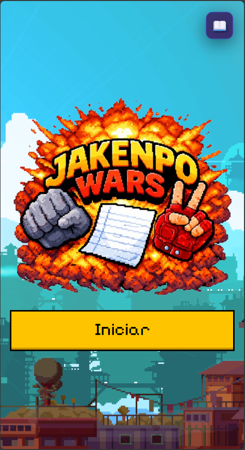

# Emoji Battle

Emoji Battle é um jogo divertido baseado no clássico Pedra, Papel e Tesoura, com mecânicas adicionais de combate, raridades e modos de jogo desafiadores.

## 🎮 Como Jogar

### Objetivo
Derrote o inimigo usando o clássico Pedra, Papel e Tesoura! Gerencie seu HP e ataque estrategicamente.

### Regras de Combate
- 🪨 **Pedra** vence Tesoura
- 📄 **Papel** vence Pedra
- ✂️ **Tesoura** vence Papel
- ⚖️ Mesma escolha = **Empate** (ambos sofrem dano)

### Mecânicas
- **HP:** Seus pontos de vida. Se chegar a 0, você perde!
- **Ataque:** Dano que seus bullets causam ao inimigo
- **Gold:** Ganhe ouro derrotando bullets inimigos
- **Raridades:** Bullets inimigos mais raros têm mais HP e dão mais ouro

### Sistema de Raridades
| Raridade   | Descrição                     |
|------------|-------------------------------|
| Comum      | Básico                        |
| Incomum    | +HP, +Ataque, +Gold                  |
| Raro       | ++HP, ++Ataque, ++Gold         |
| Heroico    | +++HP, +++Ataque, +++Gold      |
| Lendário   | ++++HP, ++++Ataque, ++++Gold   |
| Mítico     | +++++HP, +++++Ataque, +++++Gold|
| Imortal    | ++++++HP, ++++++Ataque, ++++++Gold|

### Modos de Jogo
- **Normal:** Complete a fase derrotando o inimigo ou sobrevivendo até o tempo acabar
- **Infinito:** Sobreviva o máximo de fases possível. Cada fase fica mais difícil!

### Dicas
- Fique de olho nas cores dos rastros - indicam raridade
- Bullets com barras de HP maiores exigem múltiplos acertos
- Use o ouro ganho para melhorar suas habilidades
- Em modos avançados, podem vir múltiplos bullets de uma vez!

## 🖼️ Galeria de Imagens

| Cena de Jogo         | Combate Infinito     | Loja de Itens        |
|----------------------|----------------------|----------------------|
|  |  |  |

## 🚀 Tecnologias Utilizadas
- **React** com **Vite** para desenvolvimento rápido
- **CSS** para estilização moderna e responsiva
- **React Router** para navegação entre páginas

## 📂 Estrutura do Projeto
- `src/components`: Componentes reutilizáveis do jogo
- `src/pages`: Páginas principais do jogo
- `src/utils`: Funções utilitárias para lógica do jogo

## 🛠️ Como Executar
1. Clone o repositório:
   ```bash
   git clone https://github.com/seu-usuario/emoji-battle.git
   ```
2. Instale as dependências:
   ```bash
   npm install
   ```
3. Inicie o servidor de desenvolvimento:
   ```bash
   npm run dev
   ```
4. Acesse o jogo em `http://localhost:3000`.

## 📜 Licença
Este projeto está licenciado sob a [MIT License](LICENSE).
